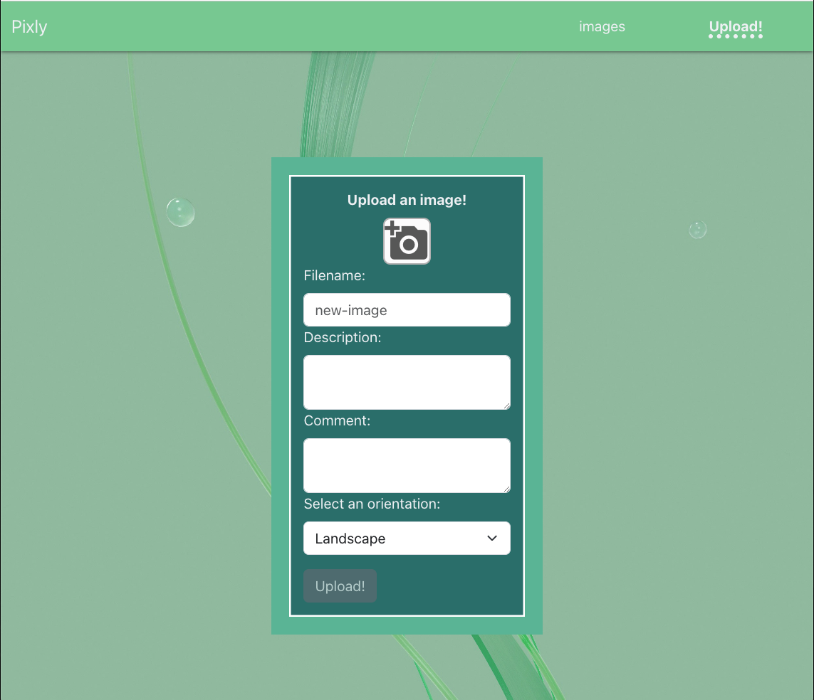
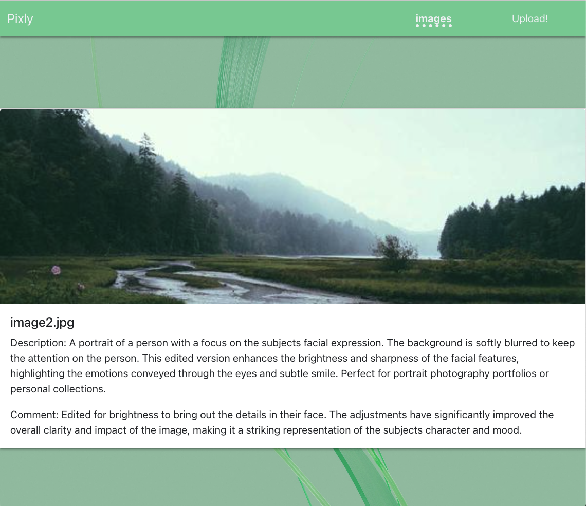

[![LinkedIn][linkedin-shield]][linkedin-url]

# PIXLY

## 💬 Introduction
Pixly is an Image Editing web app. 

The backend was built with: Typescript, Express, Node.js, PostgreSQL, TypeORM.
The frontend was built with: Typescript, React and Bootstrap.

Images are stored within AWS S3 buckets.

## Demo
[]
[]

## 🔧 Setup

- Set .env in the client folder and top level

`pixly/src/client/.env`
```.env
VITE_REACT_APP_AWS_BASE_URL=https://your-bucket-name-here.s3.amazonaws.com
```

`pixly/.env`
```.env
PORT=3001

AWS_ACCESS_KEY=your-aws-key-here
AWS_SECRET=your-secret-key-here
AWS_BUCKET_NAME=your-bucket-name-here
AWS_REGION=us-east-1

VITE_REACT_APP_AWS_BASE_URL=https://your-bucket-name-here.s3.amazonaws.com
```

To ensure that everything correctly works, Node 20 should be used.

- Install dependencies

  ```sh
  npm install
  ```

- Run express server in development mode

  ```sh
  npm run dev
  ```


- Run React FE

  ```sh
  npm run start
  ```

- Visit <http://localhost:3000>

- You can run tests with

  ```sh
  npm run test
  ```

[linkedin-shield]: https://img.shields.io/badge/-LinkedIn-black.svg?style=for-the-badge&logo=linkedin&colorB=555
[linkedin-url]: https://linkedin.com/in/anya-aven-6004b0132/
